# 100 ТЗ за 107 дней

**8 сентября 2026 года в шину Nexus влит §100.** Сто разделов технического задания — это сто
законченных постановок: от «Назначения» на четыре строки до развёртывания без простоя на двух
репликах каждого сервиса. Между первым коммитом и сотым разделом прошло 107 дней.

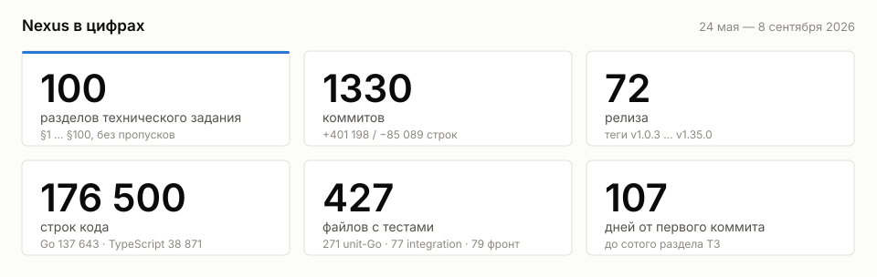

---

## Что это такое

Nexus принимает входящие HTTP-запросы, по настроенному маршруту («узлу») отправляет их во внешнюю
систему — синхронно или через очередь — и сохраняет журнал каждого вызова. Маршруты настраиваются не
в коде, а в браузере: адрес приёмника, HTTP-методы, авторизация на входе и на выходе, таймауты,
повторы, глубина логирования. Там же видно, что происходит: счётчики и графики по каждому узлу,
полный журнал запросов с телами, повтор упавшей доставки, состояние Kafka и логи самих сервисов.

### Зачем он появился

Nexus задумывался как замена связки **«1С:Шина» и сервисов интеграции 1С** — механизмов, которыми
обмен между конфигурациями и внешними системами обычно строят внутри экосистемы 1С. Замысел был в
том, чтобы вынести интеграцию из контура 1С в отдельный сервис и получить четыре вещи, которых
изнутри учётной системы добиться трудно:

- **маршрут меняется без релиза конфигурации.** Клиенту выдан адрес `…/api/v1/<команда>/<путь>`,
  а куда он ведёт на самом деле и с какой авторизацией — правится в браузере за полминуты;
- **журнал вызовов — поисковый индекс, а не выгрузка.** Каждый вызов лежит в ClickHouse с телом
  запроса и ответа, статусом, длительностью, IP и хостом клиента; отсюда же делается повтор;
- **приёмником может быть кто угодно.** Маркетплейс, эквайринг, служба доставки, другая 1С — для
  шины это просто HTTP-узел с настройками;
- **несколько команд в одном контуре.** Узлы, журналы, метрики и права разделены по командам, роли —
  admin / manager / operator / viewer, каждое изменение попадает в аудит.

Своего 1С-специфичного протокола (OData, XDTO, планы обмена) в шине нет и не планировалось: 1С ходит
в неё обычным HTTP через `/hs/…`. Но именно её профиль трафика переписал шине половину правил —
об этом отдельный раздел ниже.

### Как это работает

```text
                    ┌──────────────────────────────────────────────────┐
   клиент ─────────►│  Web :8000 — SPA + REST API + единый вход трафика │
                    └───────┬───────────────────────────────┬──────────┘
                            │ /api/v1/<команда>/<путь>       │ /api/*  (UI)
                            ▼                                ▼
                    ┌───────────────────┐            PostgreSQL — узлы, пользователи,
                    │ Receiver :8080    │              команды, аудит (креды — AES-256-GCM)
                    │ авторизация,      │            Redis — кеш узлов, сессии, статусы
                    │ резолв узла,      │
                    │ маскирование      │
                    └──┬─────────────┬──┘
              sync/gRPC│             │async → Kafka `nexus.async`
                       ▼             ▼
                    ┌───────────────────┐   HTTP    ┌──────────────────┐
                    │ Sender :9190      │──────────►│ внешняя система   │
                    │ retry, timeout,   │◄──────────│ (приёмник)        │
                    │ circuit breaker   │           └──────────────────┘
                    └─────────┬─────────┘
                              ▼
                    ClickHouse — журнал вызовов (тела, статусы, длительности)
```

Три типа узла: `request` (синхронный проброс), `requestAsync` (ответ сразу, доставка через Kafka)
и `RabbitMQAsync` (шина сама забирает сообщения из очереди RabbitMQ).

---

## Как шла работа

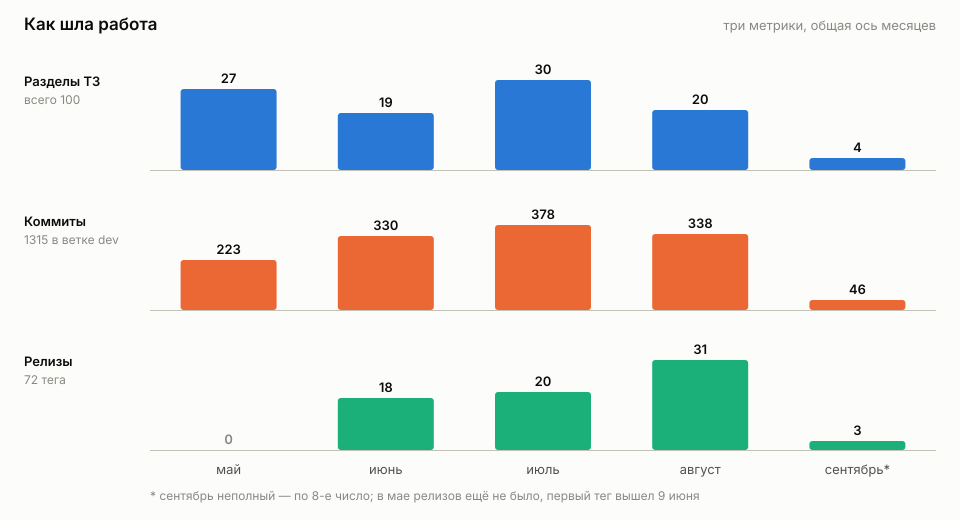

Май ушёл на постановку: 27 разделов ТЗ и ни одного релиза — первый тег вышел только 9 июня.
Дальше темп выровнялся: за июнь–август по 20–30 разделов и по 330–378 коммитов в месяц.
Август — рекорд по релизам (31): это месяц, когда шина переехала на две реплики за nginx и пережила
подряд четыре боевых инцидента.

Поворотные точки:

| Когда | Что | Почему это поворот |
| --- | --- | --- |
| v1.3.0, 22 июня | [§38](./specs/sections/38-clog-retry-kafka.md) — durable-retry журналов через Kafka | Проваленный батч логов ждёт в топике, а не в файлах на диске |
| v1.16.0, 20 июля | Таймаут узла перестал резаться 30 секундами | Боевой баг: таймаут HTTP-клиента перекрывал настройку узла |
| v1.21.0, 30 июля | [§70](./specs/sections/70-multi-instance-clickhouse.md) — маркер владения ClickHouse | Несколько инстансов Nexus на одной базе перестали трогать чужие таблицы |
| v1.26.0, 6 августа | [§81](./specs/sections/81-breaker-manual-reset.md), [§82](./specs/sections/82-sync-ceiling-and-async-ingress.md), [§83](./specs/sections/83-async-ack-template.md) | Тройной релиз из одного разбора: потолок sync-вызова, гейт async-входа, шаблон ответа приёма |
| v1.31.0, 21 августа | [§93](./specs/sections/93-ha-replicas.md) — две реплики каждого сервиса | Обновление без простоя; заодно [§94](./specs/sections/94-rejected-requests.md) — журнал отказов на входе |
| v1.32.0, 24 августа | [§95](./specs/sections/95-log-secret-masking.md) — маскирование секретов в журналах | Секрет в пути или в параметрах больше не оседает в ClickHouse |
| v1.35.0, 8 сентября | [§99](./specs/sections/99-node-groups.md), [§100](./specs/sections/100-click-targets.md) | Группировка узлов и зоны клика — сотый раздел |

---

## Что вошло в сто разделов

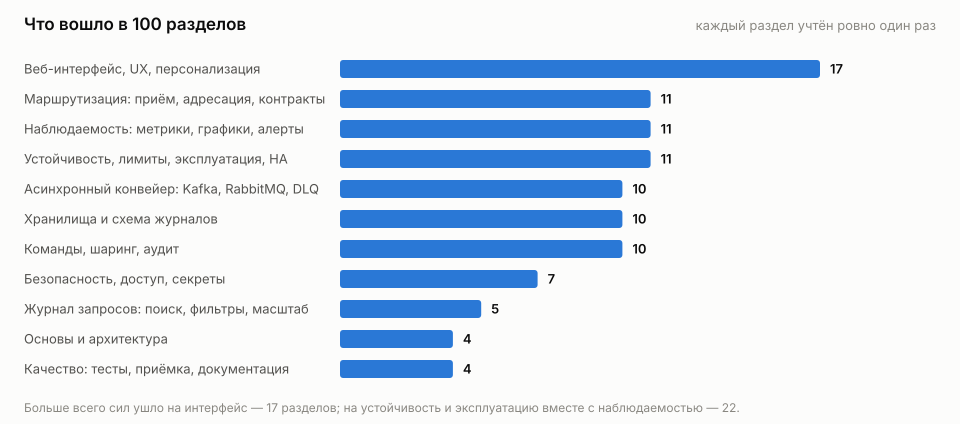

| Тема | Что там главное |
| --- | --- |
| **Веб-интерфейс, UX** (17) | Рабочий стол команды со счётчиками и спарклайнами, страница узла, редизайн под дизайн-токены, избранные команды, ссылки «поделиться», группировка узлов |
| **Маршрутизация** (11) | Три типа узла, короткий адрес `/api/v1/<команда>/<путь>`, проброс хвоста пути, метод «Любой», универсальная динамическая авторизация, multipart, защита от зацикливания |
| **Наблюдаемость** (11) | Prometheus у всех трёх сервисов, метрики узла с p95/p99, мониторинг Kafka с размером топиков через JMX, консоль логов сервисов со сменой уровня в runtime, Sentry, Telegram-алерты |
| **Устойчивость и эксплуатация** (11) | Circuit breaker с ручным сбросом, лимиты размера тела, статус OK/Degraded/Down, безопасный откат версии, две реплики за nginx |
| **Асинхронный конвейер** (10) | Kafka, забор из RabbitMQ, dead-letter и авто-репроцессор, изоляция узлов в очереди, повтор за период, тело повтора из очереди |
| **Хранилища и журналы** (10) | Шаблоны таблиц ClickHouse, синхронизация схемы, внешняя (ручная) таблица, атрибуция записей по узлу, несколько инстансов на одной базе |
| **Команды и аудит** (10) | Multi-tenancy, копирование и перенос узла, глобальный поиск, реестр инстансов, сквозной режим «Все команды», журнал аудита |
| **Безопасность** (7) | AES-256-GCM для кред узлов и секретов настроек, каталог разрешённых хостов (SSRF), четыре роли, восстановление пароля по почте, маскирование секретов в журналах |
| **Журнал запросов** (5) | Поисковый мини-язык с regex, серверная фильтрация с keyset-пагинацией, автоокно чтения, большие тела срезами, live-tail |
| **Основы и качество** (8) | Clean Architecture, структура репозитория, уровни тестирования, Swagger двух API, критерии приёмки |

---

## Nexus и 1С

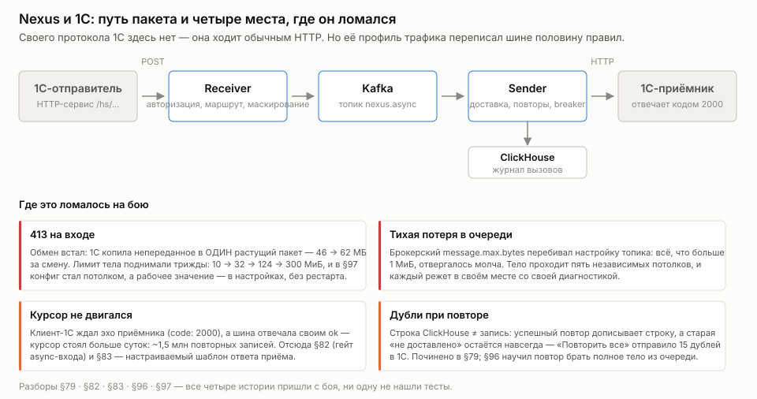

1С — не «одна из систем на другом конце». Это нагрузка, которая сформировала шину. Четыре истории,
каждая пришла с боя, ни одну не нашли тесты.

**Пакет, который растёт, пока не упрётся.** 1С копит непереданное в один пакет и не дробит его.
Узел `dconv` 2 сентября: обмен встал в 11:08, пакет рос с 46 до 62 МБ за смену (+2 МБ в час) и
получал 413 на каждой попытке раз в пятнадцать минут. Лимит тела поднимали трижды — 10 → 32 → 124 →
300 МиБ, — и в [§97](./specs/sections/97-configurable-body-limits.md) конфиг наконец стал *потолком*,
а рабочее значение переехало в интерфейс, где меняется без рестарта. Первый подъём, кстати, тоже был
из-за 1С: подписанные ЭЦП-пакеты 1С/СБИС несут вложение в теле в base64 (+33% объёма), и десять
мегабайт кончались уже на файле в семь.

**Идемпотентность приёмника как ограничитель повторов.** 5 августа оператор нажал «Повторить все
неудачные» — и получатель, 1С `acc_kz`, принял 15 дублей. Корень:
[строка ClickHouse ≠ запись](./specs/sections/79-failed-unit-node-tab-metrics.md) — успешный повтор
дописывает новую строку, а старая «не доставлено» остаётся навсегда. Из этого выросли и защита от
самоусиления в [§85](./specs/sections/85-replay-from-logs.md), и вердикт «воздержался» в
[§81](./specs/sections/81-breaker-manual-reset.md): если приёмник тело принял и, вероятно, обработал,
повторять нельзя.

**Курсор, который двигается только по эху.** Узел `acs_sigur`: клиент-1С слал около одиннадцати
async-запросов в минуту и ждал в ответ `code: 2000` от приёмника, а шина честно отвечала своим
мгновенным `{"result":true}`. Курсор не сдвинулся ни разу — за сутки около 1,5 млн повторных записей
в приёмник. Ответ: [§82](./specs/sections/82-sync-ceiling-and-async-ingress.md) — гейт async-входа,
и [§83](./specs/sections/83-async-ack-template.md) — настраиваемый шаблон ответа приёма, чтобы шина
отвечала на языке клиента.

**Обмен 1С → 1С и усечённое тело.** 31 августа, узел `it_upr-vika`: приёмник какое-то время отвечал
503, записи попали в «неудачные», оператор нажал повтор — и доставка стала невозможной навсегда.
Повтор брал журнальную копию тела, обрезанную по лимиту логирования, вместе с маркером «усечено».
[§96](./specs/sections/96-replay-body-from-queue.md) научил повтор брать полное тело из очереди
Kafka, а журнал оставил индексом.

Клиентов-1С видно и в самом журнале: [§67](./specs/sections/67-client-host-rdns.md) добавил колонку
`client_host` с обратным DNS — вместо голого IP в фильтре стоит имя сервера. А «1С Обмен» стал
каноническим примером группы узлов в [§99](./specs/sections/99-node-groups.md).

---

## Двенадцать историй, которых не было в плане

Разделы ТЗ пишутся заранее. Всё интересное — то, что нашлось потом.

**1. Брокер перебивает настройку топика.** Топик создавался с `max.message.bytes` из конфига, а
брокер в compose не задавал `message.max.bytes` — и его дефолт в 1 МиБ молча выигрывал. Строки
журнала терялись. Урок: тело проходит **пять** независимых потолков (nginx → Receiver → gRPC → Kafka
→ брокер), и три из них живут вне образов приложения.

**2. Незакоммиченное сообщение Kafka не возвращается.** Клиентская библиотека двигает внутренний
курсор при выборке; отсутствие коммита не возвращает сообщение тому же читателю. Если следующее
сообщение партиции получало подтверждение, committed offset прокатывался мимо — и сообщение исчезало
навсегда. Лечили дважды: сперва повтор на месте, потом отдельный delay-топик, потому что удержание
партиции блокировало соседей (партиций четыре, узлов десятки — это арифметика, а не редкая
коллизия).

**3. Потолок синхронного вызова прятался в keepalive.** «Таймаута нет» и «оборвать не может» —
разные утверждения. Все дедлайны были честно пустыми, а рвал вызов gRPC: сервер без явной
keepalive-политики берёт минимальный интервал в пять минут, клиент пингует раз в тридцать секунд, и
на четвёртом нарушении прилетает `GOAWAY ENHANCE_YOUR_CALM` с закрытием соединения. Неверный вывод
продержался месяцы и увёл боевой разбор во внешнюю инфраструктуру больше чем на сутки.

**4. Гейт владения спрятал десять миллионов записей.** [§70](./specs/sections/70-multi-instance-clickhouse.md)
ввёл маркер владения таблицей — и узел на внешней таблице
[§64](./specs/sections/64-manual-external-table.md) показал пустой журнал при 10 222 523 записях в
базе. У внешней таблицы маркера нет и быть не может, значит «не наша» для неё истинно всегда.
Урок сформулирован дословно: включение нового гейта требует теста на **каждом** пути, куда он
подмешивается, а не только на том, ради которого вводился.

**5. Синтаксис PostgreSQL 15 при боевом PostgreSQL 12.** Первая редакция миграции использовала
конструкцию, доступную только с пятнадцатой версии. Тесты и compose поднимают шестнадцатую — все
гейты зелёные, а на бою миграция не применилась бы и сервисы не поднялись бы вообще. Отсюда правило:
дефолтный образ в integration-тестах — **минимальная поддерживаемая версия**. Тестировать на версии
свежее боевой — значит не тестировать совместимость.

**6. Чтение маскировало запись в Sentry девять к одному.** При лежащем ClickHouse страница логов
отдавала 500, клиент ретраил, поллинг перезапускал цикл — и за пару минут открытой вкладки
read-path генерировал десятки событий, заваливая настоящие ошибки вставки. Разделили: сбой
*доступности* — это 200 с признаком «журнал недоступен», а серверная ошибка запроса остаётся 500 и
летит в Sentry.

**7. Healthcheck роняет брокер.** Переменная с JMX-агентом наследуется утилитами командной строки —
а проверка здоровья брокера и есть такая утилита. Она подхватывала агент, пыталась занять уже
занятый порт и выходила с ошибкой; брокер оставался вечно `unhealthy`, а Sender, ждущий здорового
брокера, не поднимался вовсе. Ни один Go-тест и ни один линтер этого не видит.

**8. Prometheus не перечитывает конфиг.** `docker compose up -d` видит неизменную спецификацию
(«Container … Running») и оставляет старый конфиг в памяти. Симптом коварен: брокер исправен и
отдаёт метрику, но её никто не снимает — и оператор идёт чинить работающий брокер. Нужен именно
`restart`.

**9. Линтер показывает то, чего нет.** Прогон стабильно выдавал восемь предупреждений о возможном
разыменовании nil; находки появлялись и исчезали от смены набора линтеров. Это оказался чистый
артефакт кеша: после его очистки — ноль issues два прогона подряд. Прежде чем чинить код под
неожиданную находку статического анализатора, чистите кеш — иначе «починишь» правильный код под
фантом.

**10. Локальный прогон тестов слабее CI.** Локальная цель гоняла восемь под-прогонов с фильтрами по
имени теста, а CI запускал пакет целиком. На момент находки **26 тестов из 145** не матчились ни
одним фильтром — то есть локально не выполнялись никогда. Теперь первой целью стоит скрипт, который
сверяет список тестов с объединением всех фильтров: ни Docker, ни сети ему не нужно.

**11. Ключ кеша без команды.** Жалоба звучала так: «стёр поле поиска — открылись узлы не той
команды». Список узлов держал ключ кеша без идентификатора команды, а сервер фильтрует по команде
сессии — один слот хранил список «какой команды он был в последний раз». Правило: ключ эндпоинта,
фильтруемого по команде сессии, обязан включать идентификатор команды.

**12. Балансировщик не прозрачен по умолчанию.** Четыре дефолта nginx меняют запрос молча, и самый
опасный — подстановка host без порта. CSRF-проверка сравнивает хост из `Origin` с заголовком `Host`,
получалось «localhost» против «localhost:8000» — 403 на любой мутирующий запрос. То есть панель за
балансировщиком не работала бы вообще. Нашёл это только живой прогон на стенде.

Отдельная категория — **инциденты, где виноват не код**. 29 июля узел эквайринга, не менявшийся
неделю, начал отдавать 100% ошибок: контрагент сменил удостоверяющий центр. Симптом двухслойный:
настоящая причина (`certificate signed by unknown authority`) видна лишь в первых записях — после
пяти неудач открывается circuit breaker, и дальше 90% журнала занимает безликое
`circuit_breaker_open`. Диагностируя «узел встал», ищите **самую раннюю** причину, а не
преобладающую.

---

## Сколько бы это заняло одному программисту

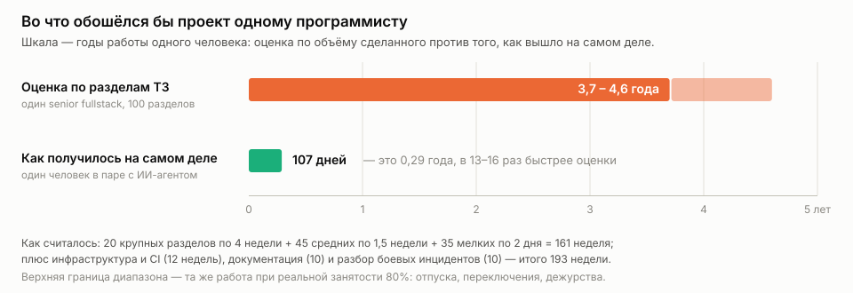

Считали по объёму сделанного, а не по ощущениям. Сто разделов разбиты на три класса: двадцать
крупных (новая подсистема — очередь, роли и права, отказоустойчивость, серверная фильтрация журнала)
по четыре недели, сорок пять средних по полторы, тридцать пять мелких по два дня. Это 161 неделя.
Сверх того — инфраструктура и CI (11 job'ов, пять стадий, контейнерные тесты, нагрузочные сценарии)
двенадцать недель, документация — сорок тысяч строк markdown — десять недель, и разбор боевых
инцидентов ещё десять. Итого **193 недели, или 3,7 года** непрерывной работы одного senior
fullstack.

Непрерывной работы не бывает: при реальной занятости около 80% — отпуска, переключения контекста,
дежурства — это **4,6 года**.

Фактически прошло **107 дней**. Разница в 13–16 раз — не «магия ИИ»: работа шла с полной дисциплиной
инженерного процесса. Каждый блок закрывался тестами, линтером и записью в карту реализации; каждый
релиз — строкой отката в CHANGELOG; каждое ТЗ — ревизией всего диффа и живым прогоном на стенде
перед сдачей. Из 72 тегов два так и не выпущены, потому что покраснел CI.

Для сравнения — что стоит за этими днями:

| | |
| --- | --- |
| Go | 697 файлов, 137 643 строки |
| TypeScript / React | 235 файлов, 38 871 строка |
| Тесты | 271 unit-Go + 77 integration + 79 фронтовых файлов |
| Миграции PostgreSQL | 42 |
| Документация | 121 markdown-файл, 39 715 строк |
| Техническое задание | 100 разделов, 23 588 строк, около 196 тысяч слов |

---

## Как это выглядит

Скриншоты сняты на тестовом стенде, данные синтетические.

| Рабочий стол команды | Страница узла |
| --- | --- |
| [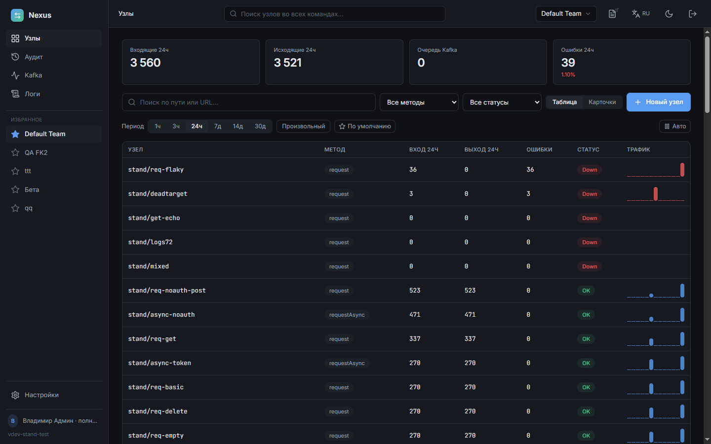](docs/img/overview.png) | [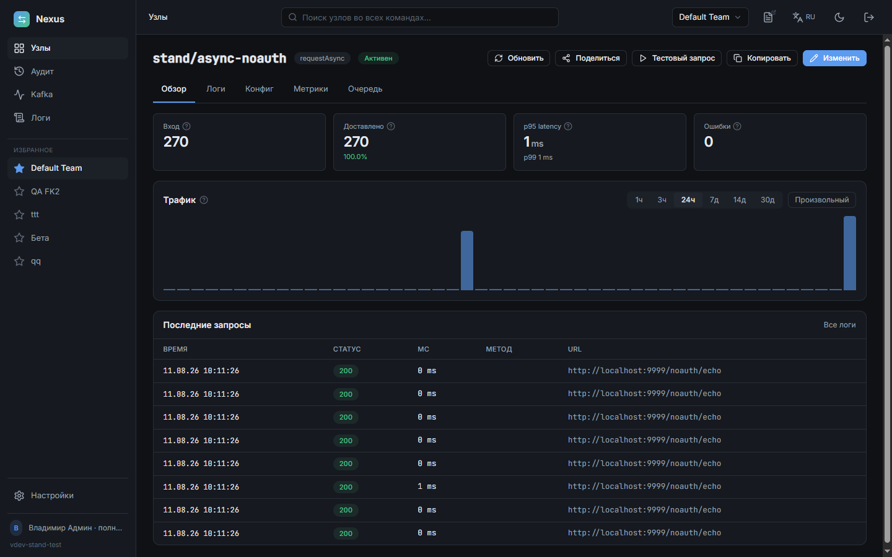](docs/img/node-overview.png) |

| Журнал запросов | Метрики узла |
| --- | --- |
| [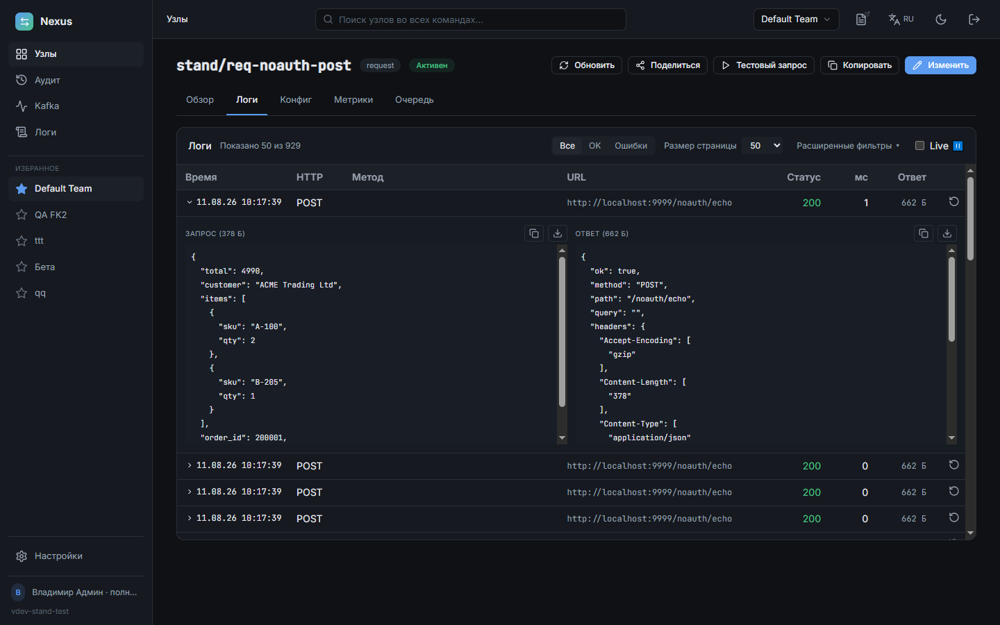](docs/img/node-logs.png) | [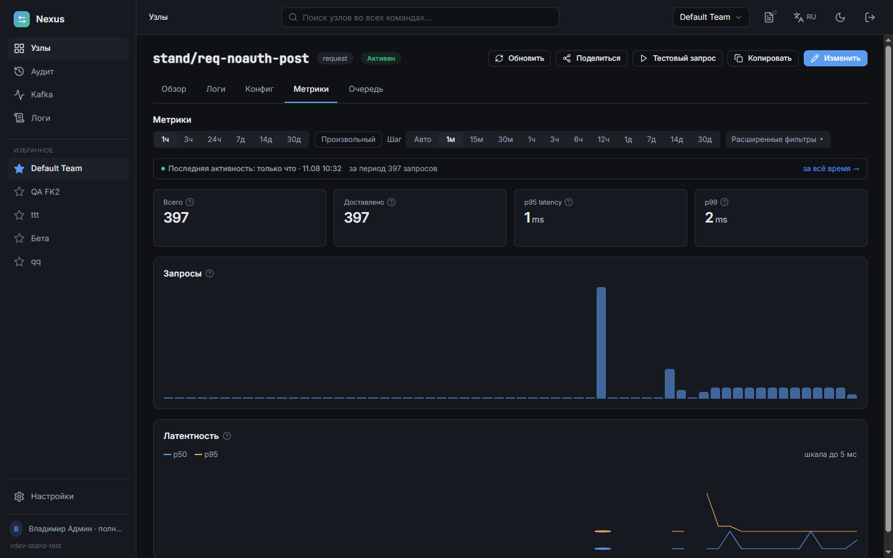](docs/img/node-metrics.png) |

| Очередь и защита узла | Мониторинг Kafka |
| --- | --- |
| [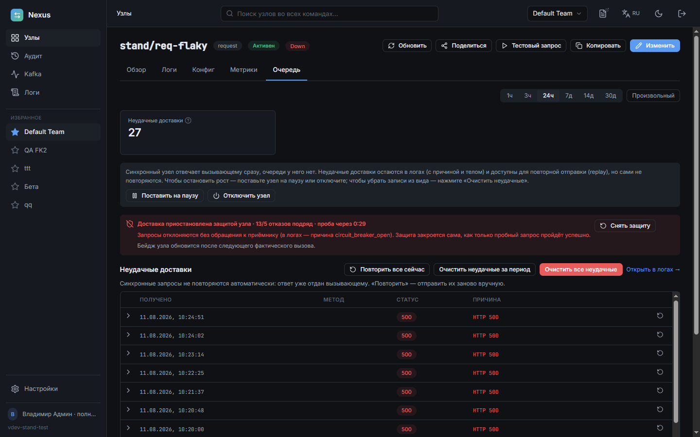](docs/img/node-queue.png) | [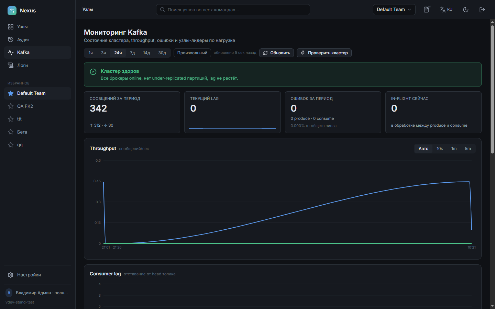](docs/img/kafka.png) |

| Логи сервисов | Журнал аудита |
| --- | --- |
| [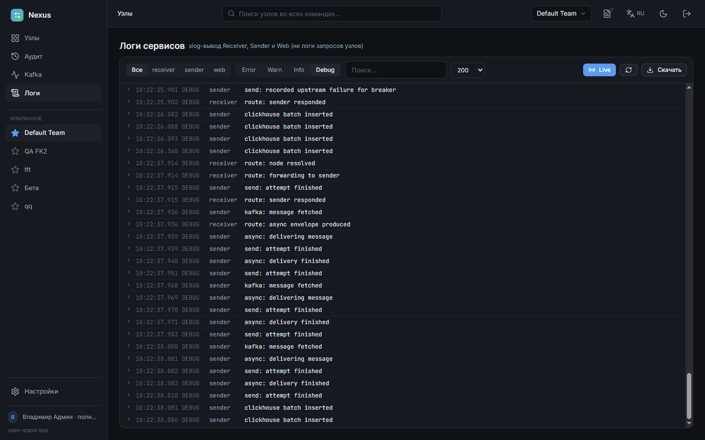](docs/img/service-logs.png) | [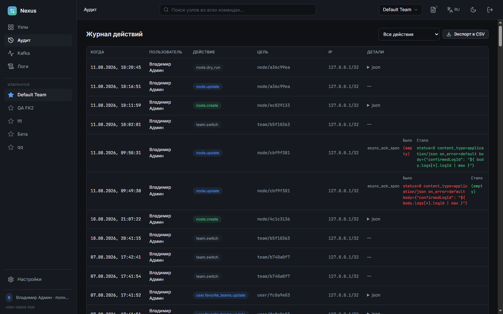](docs/img/audit.png) |

---

## Все сто разделов

<details>
<summary>Развернуть список §1 … §100</summary>

- **[§1](./specs/sections/01-purpose.md)** — Назначение
- **[§2](./specs/sections/02-architecture.md)** — Архитектура верхнего уровня
- **[§3](./specs/sections/03-receiver.md)** — Receiver Service — эндпоинты, семантика, конфиг узла, URL-режимы, авторизация, состояния
- **[§4](./specs/sections/04-sender.md)** — Sender Service — gRPC API, устройство, логирование в ClickHouse
- **[§5](./specs/sections/05-storage.md)** — Хранилища: PostgreSQL, ClickHouse, Kafka, Redis, шифрование
- **[§6](./specs/sections/06-metrics.md)** — Метрики и наблюдаемость
- **[§7](./specs/sections/07-web-ui.md)** — Веб-интерфейс — экраны, аутентификация, audit log, API-токены
- **[§8](./specs/sections/08-config.md)** — Конфигурация приложения — файлы, env, config.yml
- **[§9](./specs/sections/09-resilience.md)** — Высоконагруженность и отказоустойчивость
- **[§10](./specs/sections/10-testing.md)** — Тестирование — уровни, сценарный тест
- **[§11](./specs/sections/11-swagger.md)** — Swagger / OpenAPI
- **[§12](./specs/sections/12-repo-structure.md)** — Структура репозитория
- **[§13](./specs/sections/13-build-run.md)** — Сборка и запуск — Makefile, Docker Compose
- **[§14](./specs/sections/14-logging-sentry.md)** — Логирование и Sentry
- **[§15](./specs/sections/15-acceptance.md)** — Критерии приёмки
- **[§16](./specs/sections/16-out-of-scope.md)** — Out of scope в v1 / планы на v2
- **[§17](./specs/sections/17-patterns.md)** — Паттерны разработки (Clean Architecture, фронтенд)
- **[§18](./specs/sections/18-multi-tenancy.md)** — Multi-tenancy v2 — команды, изоляция, CH-БД per team, перенос узлов
- **[§19](./specs/sections/19-ch-templates.md)** — Шаблоны запросов ClickHouse — каталог DDL, CODEC/индексы/TTL, авто-создание таблицы узла
- **[§20](./specs/sections/20-notifications.md)** — Уведомления операторам в Telegram — cron-расписание, ошибки узлов, тестовая отправка
- **[§21](./specs/sections/21-ui-redesign.md)** — Редизайн UI под эталон (дизайн-токены, UI-kit, app-shell) + HTTP-API метрик панели (Prometheus + ClickHouse)
- **[§22](./specs/sections/22-logging-controls-cards.md)** — Контроль логирования узла (тумблер, обрезка тел), раскладка карточками Overview, перевод Telegram-алертов на Promet…
- **[§23](./specs/sections/23-allowed-hosts-catalog.md)** — Каталог разрешённых хостов (SSRF) — общий справочник exact/wildcard/regex, привязка к узлам, preview, denорм-снимок
- **[§24](./specs/sections/24-headers-catalog.md)** — Справочник HTTP-заголовков — combobox с автодополнением и автосозданием, usage_count on-read
- **[§25](./specs/sections/25-topbar-swagger.md)** — Swagger в шапке — два дока (Receiver + Web), popover, раздача обоих Web-бинарём
- **[§26](./specs/sections/26-roles-access-control.md)** — RBAC — три роли (Admin/Manager/Viewer), иерархия рангов, матрица доступа, self-service смена своего пароля
- **[§27](./specs/sections/27-rabbitmq-async.md)** — Тип узла RabbitMQAsync — Puller-воркер RabbitMQ→Kafka, поля rmq_*/pull_*, runtime-degraded, POST /api/nodes/test-rm…
- **[§28](./specs/sections/28-online-metrics.md)** — Онлайн-метрики и UX — публичный адрес приложения, онлайн-обновление метрик, период просмотра (1h..30d+календарь), м…
- **[§29](./specs/sections/29-node-comment.md)** — Комментарий узла — текстовое описание для команды (поле comment, форма/обзор узла), UI-метаданные вне маршрутизации
- **[§30](./specs/sections/30-logging-panic-recovery.md)** — Логирование, обработка паник и идентификация запросов — safego.Recover во всех горутинах, кастомный gin-recovery (5…
- **[§31](./specs/sections/31-kafka-monitoring.md)** — Мониторинг Kafka — admin-only alarm-dashboard /kafka (в блоке Аудита, не в Настройках): health-banner, KPI, through…
- **[§32](./specs/sections/32-loop-protection.md)** — Защита от зацикливания — служебный hop-счётчик X-Nexus-Hops (инкремент на каждом проходе через шину, обрыв при rece…
- **[§33](./specs/sections/33-chart-tooltips.md)** — Доработка тултипов графиков — единый презентационный <ChartTooltip> (период → главное значение → серии с маркерами…
- **[§34](./specs/sections/34-ops-session-version-async-queue.md)** — Операбельность — «Настройки» вниз сайдбара; настраиваемая длительность сессии (app_settings + динамический провайде…
- **[§35](./specs/sections/35-queue-tab-rework.md)** — Переработка вкладки «Очередь» (перерабатывает §34.4/§34.6) — реальная модель потока (enabled+мёртвый адрес → DLQ, н…
- **[§36](./specs/sections/36-dlq-reprocessor.md)** — Авто-репроцессор DLQ (развивает §34.4/§35) — фоновый периодический sweeper в Sender повторно доставляет неудачные a…
- **[§37](./specs/sections/37-node-id-in-logs.md)** — Идентификатор узла в логах — колонка node_id (UUID) в CH-таблице: per-node атрибуция для узлов, делящих одну таблиц…
- **[§38](./specs/sections/38-clog-retry-kafka.md)** — Durable-retry проваленных CH-батчей через Kafka (замена NDJSON-fallback) — при недоступности ClickHouse Sender прод…
- **[§39](./specs/sections/39-path-passthrough.md)** — Path-passthrough — опциональный флаг узла path_passthrough: хвост входящего пути после пути узла приклеивается к ta…
- **[§40](./specs/sections/40-any-http-method.md)** — HTTP-метод «Любой» (ANY) для входящего и исходящего метода узла. Вх=ANY — узел принимает запрос любым методом (без…
- **[§41](./specs/sections/41-universal-request-auth.md)** — Универсальная динамическая авторизация — источник (заголовок/параметр) + имя поля для входящей (token/basic, колонк…
- **[§42](./specs/sections/42-log-body-streaming.md)** — Динамическая подгрузка тел логов — фикс зависания вкладки «Логи» на большом теле. Get отдаёт превью (первые 64K рун…
- **[§43](./specs/sections/43-body-size-hard-limit.md)** — Жёсткий лимит размера тела — при max_body_size_enabled тело > лимита больше НЕ усекается тихо (§22.2 superseded): s…
- **[§44](./specs/sections/44-dashboard-counters.md)** — Счётчики дашборда: шапка = Σ строк таблицы за выбранный период из ClickHouse (уникальные запросы), а не из Promethe…
- **[§45](./specs/sections/45-user-default-team.md)** — Смена команды по умолчанию пользователя прямо в списке Settings → Users — клик по чипу команды в колонке «Команды».…
- **[§46](./specs/sections/46-node-status-redis.md)** — Персистентный статус «Down» узла через Redis (переживает рестарт). §41-гаудж nexus_node_last_request_error in-memor…
- **[§47](./specs/sections/47-logs-filter-refinements.md)** — Доработка фильтра логов узла и деталей лога (развивает §33.4/§42/§44). §47.1 — клик по столбцу графика по сегментам…
- **[§48](./specs/sections/48-log-search-extended.md)** — Расширенный поиск по логам узла (log-search v2) (развивает §7.4/§42/§47). Мини-язык q: &=И, \ =ИЛИ, -=НЕ, префиксы…
- **[§49](./specs/sections/49-favorite-teams.md)** — Избранные команды (развивает §18/§45). Отображаемое имя команды без slug в шапке и списке переключателя (кастомный…
- **[§50](./specs/sections/50-node-cache-teamslug-redirects.md)** — Кеш узла по реальной команде + видимость редиректов + breaker (боевой баг + §18/§9.2). Web писал/инвалидировал ключ…
- **[§51](./specs/sections/51-service-logging.md)** — Управление логированием сервисов (ТЗ зафиксировано, реализация не начата). Служебные slog-логи всех трёх процессов…
- **[§52](./specs/sections/52-node-degraded-status.md)** — Трёхсостоянье статуса узла OK / Degraded / Down (развивает §41/§46/§50.4). Продолжение инцидента site/push: серия 4…
- **[§53](./specs/sections/53-copy-node.md)** — Копирование узла (развивает §3.3/§5.5/§18/§23/§26). POST /api/nodes/{id}/copy (manager+): серверный клон всех настр…
- **[§54](./specs/sections/54-overview-filter-persistence.md)** — Сохранение фильтров рабочего стола (развивает §7.3/§28.4/§44.B). Баг-репорт: поиск/метод/статус/период сбрасывались…
- **[§55](./specs/sections/55-dry-run-real-call.md)** — Dry-run: реальный вызов target (развивает §7.5.1/§4/§23/§32.2/§9.5/§46/§52). Боевой инцидент: узел висел 30с, а dry…
- **[§56](./specs/sections/56-ch-schema-sync.md)** — Синхронизация схемы ClickHouse существующей таблицы (ALTER) (развивает §19/§4.3/§22/§26; закрывает ловушку C.1). См…
- **[§57](./specs/sections/57-node-cache-invalidation.md)** — Гарантированная инвалидация конфига узла в Receiver (развивает §9.2/§50/§51). Окно рассинхрона: write-through в Red…
- **[§58](./specs/sections/58-node-share.md)** — Поделиться узлом (развивает §18/§26/§53/§7.4). Кнопка «Поделиться» копирует ссылку на страницу узла в UI (${origin}…
- **[§59](./specs/sections/59-nodes-ui-charts-config.md)** — Мини-графики в списке узлов, перенос узла из формы, конфиг узла и копирование URL лога (развивает §22/§18/§21/§47…
- **[§60](./specs/sections/60-node-move-shared-table.md)** — Перенос узла не утаскивает общую таблицу логов (чинит дефект §18 Move). RENAME TABLE выполнялся безусловно, хотя cl…
- **[§61](./specs/sections/61-log-attribution-and-move-preview.md)** — Атрибуция записей на общей таблице логов и предпросмотр переноса (продолжение §60, развивает §37/§18/§7.4). Фильтр…
- **[§62](./specs/sections/62-global-node-search.md)** — Глобальный поиск узлов + история поиска (развивает §18/§26/§49/§54/§58). Поле поиска в шапке ищет узлы во ВСЕХ кома…
- **[§63](./specs/sections/63-node-author.md)** — Автор создания и последнего изменения узла (развивает §21/§26/§59). В инфо-вкладке «Конфиг» узла — строка «Создано»…
- **[§64](./specs/sections/64-manual-external-table.md)** — Ручная (внешняя) таблица логов ClickHouse (развивает §19/§37/§56/§61). Режим «Nexus как фронт логирования»: в CH-та…
- **[§65](./specs/sections/65-node-form-team-display.md)** — Команда узла на форме и представление «только имя» (развивает §18/§21/§58/§59). Форма узла получает read-only строк…
- **[§66](./specs/sections/66-user-display-name.md)** — Отображаемое имя пользователя (развивает §7.1/§7.9/§26/§63). Обязательное поле «Имя»: колонка users.name (миграция…
- **[§67](./specs/sections/67-client-host-rdns.md)** — Хост клиента в логах (reverse-DNS) + фильтр + счётчик «Всего» (развивает §4.3/§42.10/§48/§64). Колонка client_host…
- **[§68](./specs/sections/68-multipart-form-data.md)** — Поддержка multipart/form-data (развивает §4.3/§22.2/§42.10/§7.4.1/§43). Полная проброска тела с вложениями отправит…
- **[§69](./specs/sections/69-queue-tab-and-target-url.md)** — Вкладка «Очередь» для всех типов узлов, схема target_url, пересборка адреса доставки (развивает §34/§35/§36/§3.3–3.…
- **[§70](./specs/sections/70-multi-instance-clickhouse.md)** — Несколько нод Nexus на одном ClickHouse (развивает §18/§19/§4.3/§56/§64/§14/§6). Нода = самостоятельное развёртыван…
- **[§71](./specs/sections/71-user-preferences.md)** — Персональные предпочтения пользователя: дефолтный период рабочего стола per-team (развивает §44.B/§54/§18). Дефолтн…
- **[§72](./specs/sections/72-logs-server-side-filter.md)** — Серверная фильтрация логов узла (развивает §7.4/§35/§44/§48/§64/§67). Боевой инцидент: при фильтре «Ошибки» шапка п…
- **[§73](./specs/sections/73-instances-registry.md)** — Реестр инстансов в интерфейсе (развивает §70; опирается на §30/§34.3, §9.6, §26, §7.13). §70 ввёл понятие инстанса…
- **[§74](./specs/sections/74-safe-rollback.md)** — Безопасный откат на предыдущую версию (развивает §5.1/§14/§6/§70). Стратегия эксплуатации 24/7 — «при критическом д…
- **[§75](./specs/sections/75-topic-size-jmx.md)** — Размер топиков Kafka на экране мониторинга (развивает §31, опирается на §6/§13). Колонка «Размер» в таблице «Топики…
- **[§76](./specs/sections/76-team-share.md)** — Ссылка на команду: параметр ?team=<slug> и кнопка «Поделиться» (развивает §18/§58/§49/§54/§71, frontend-only). Акти…
- **[§77](./specs/sections/77-logs-ux-and-scale.md)** — Логи узла: живое раскрытое тело, автопоиск и скорость на десятках миллионов записей (развивает §7.4/§42/§44.K/§48/§…
- **[§78](./specs/sections/78-node-url-and-log-counters.md)** — Адрес узла без сегмента метода, счётчик логов по записям, проброс параметров при смене метода (развивает §3/§18/§32…
- **[§79](./specs/sections/79-failed-unit-node-tab-metrics.md)** — Неудачные доставки как записи, вкладка узла в адресе, фильтры и шаг графика метрик, goleak (развивает §35/§36/§21/§…
- **[§80](./specs/sections/80-async-throughput.md)** — Пропускная способность async-очереди: медленный узел не должен задерживать остальных (развивает §3.5/§5.1/§9/§31/§3…
- **[§81](./specs/sections/81-breaker-manual-reset.md)** — Circuit breaker: отмена вызывающей стороны, ручной сброс, настраиваемая политика (развивает §9.5/§50.4/§52/§36/§79.…
- **[§82](./specs/sections/82-sync-ceiling-and-async-ingress.md)** — Потолок длительности sync-вызова и гейт async-входа (развивает §3/§9.3/§78/§81.2). Продолжение разбора acs_sigur 06…
- **[§83](./specs/sections/83-async-ack-template.md)** — Шаблон ответа приёма (ack) для async-узлов (развивает §3.1/§3.6/§16/§36/§78.1/§82.3). Узел декларативно описывает…
- **[§84](./specs/sections/84-node-observability.md)** — Наблюдаемость узла: шаг графика, произвольный период, латентность, пульс, ответ шины (развивает §33/§48/§52/§71/§79…
- **[§85](./specs/sections/85-replay-from-logs.md)** — Повторная отправка запросов из логов за период (развивает §7.4.1/§35/§36.11/§79.2/§48/§72/§78.6/§84.4). Боевой инци…
- **[§86](./specs/sections/86-all-teams-scope.md)** — Сквозной просмотр узлов всех команд («Все команды») (развивает §18/§44/§49/§62/§65/§71/§76). На бою двенадцать кома…
- **[§87](./specs/sections/87-operator-role.md)** — Роль «Оператор» (развивает §26/§35/§85/§7.4.1/§81.4/§7.9/§7.10). Четвёртая роль UI между viewer и manager: дежурный…
- **[§88](./specs/sections/88-mail-password-reset.md)** — Почта (SMTP) и восстановление пароля (развивает §7.1/§7.9/§7.10/§20/§26.4/§28/§9.4). Забытый пароль чинился только…
- **[§89](./specs/sections/89-misc-improvements.md)** — Разные улучшения: локальные шрифты, код ноды во вкладке, ссылки на команду, внешний адрес (развивает §21/§70.8/§49.…
- **[§90](./specs/sections/90-external-services-security.md)** — Безопасность внешних сервисов: секреты в БД, Secure-кука, автозаполнение форм (развивает §5.5/§7.1/§14.5/§8.4/§20/§…
- **[§91](./specs/sections/91-audit-scale-and-scope.md)** — Журнал аудита: объём выдачи, видимость записей, состав событий (развивает §7.13/§18.1/§26/§87/§86.7/§72/§77). Жалоб…
- **[§92](./specs/sections/92-default-period-everywhere.md)** — Кнопка «По умолчанию» на всех экранах с периодом (развивает §71/§44.B/§86.7/§84.3). §71 закрепил дефолтный период з…
- **[§93](./specs/sections/93-ha-replicas.md)** — Развёртывание без простоя: две реплики каждого сервиса (закрывает обещание §9.1, опирается на §74/§70/§51/§27/§31).…
- **[§94](./specs/sections/94-rejected-requests.md)** — Журнал отказов на входе («Отказы») (развивает §3/§40/§41/§51/§67/§72/§77). Запрос к несуществующему узлу или недопу…
- **[§95](./specs/sections/95-log-secret-masking.md)** — Маскирование секретов в логах узлов по шаблонам (развивает §22/§39/§48/§51/§64/§70, дополняет §94). При path_passth…
- **[§96](./specs/sections/96-replay-body-from-queue.md)** — Повтор берёт тело из очереди, а не из журнала (развивает §7.4.1/§36.11/§79.2/§85, опирается на §22.2/§43 и §36). Бо…
- **[§97](./specs/sections/97-configurable-body-limits.md)** — Настраиваемые лимиты размера тела: конфиг — потолок, интерфейс — рабочее значение (развивает §43 и §14.5). До 1.34.…
- **[§98](./specs/sections/98-ui-usability-and-node-protection.md)** — Юзабилити интерфейса и настройки защиты узла (развивает §5.5, §44.K, §81.3, §36.10/§79.2, §94.7, §90.3, §79.3). Сем…
- **[§99](./specs/sections/99-node-groups.md)** — Группировка узлов (развивает §7.3, §22.5, §54, §86.10, §26; устройство справочника — по §24). В команде накапливают…
- **[§100](./specs/sections/100-click-targets.md)** — Зоны клика и природа навигационных элементов (развивает §7.3, §79.3, §89.3, §98.2, §98.3). Оператор на бою не смог…

</details>

---

Полное ТЗ — [specs/nexus_spec.md](./specs/nexus_spec.md), по разделам —
[specs/sections/](./specs/sections/). Карта реализации: что готово, где лежит код и какие там
грабли — [specs/IMPLEMENTATION.md](./specs/IMPLEMENTATION.md).

*Nexus распространяется на условиях [GNU GPL v3](./LICENSE).*
