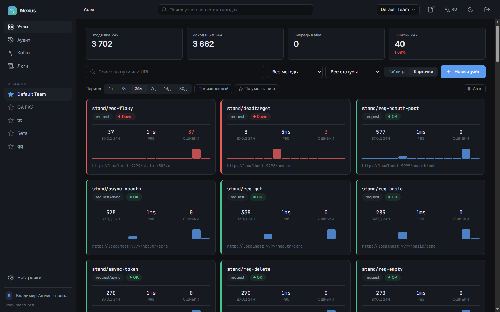
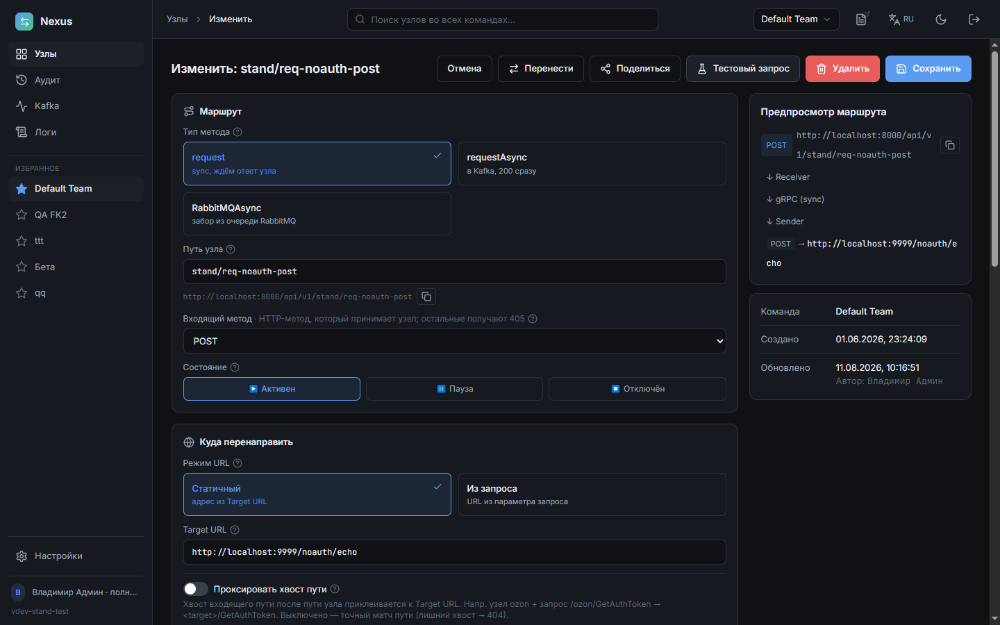
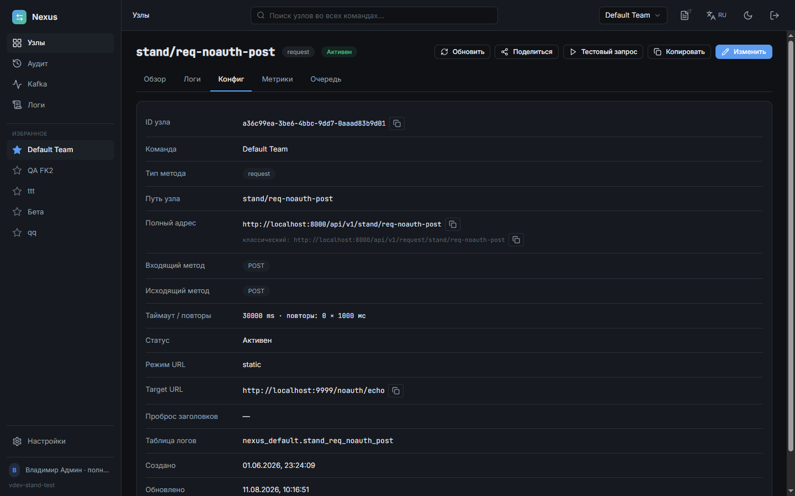
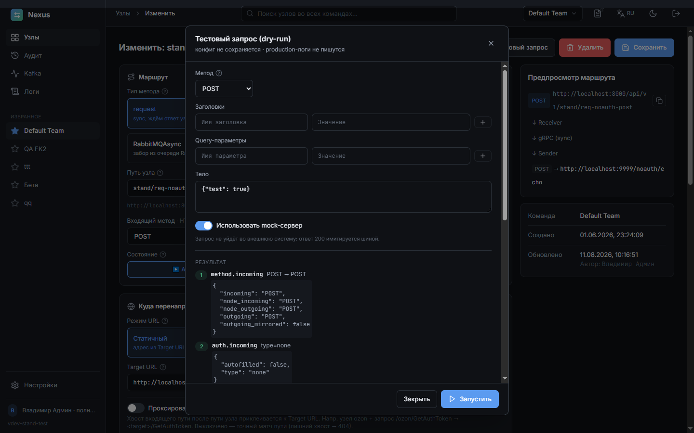
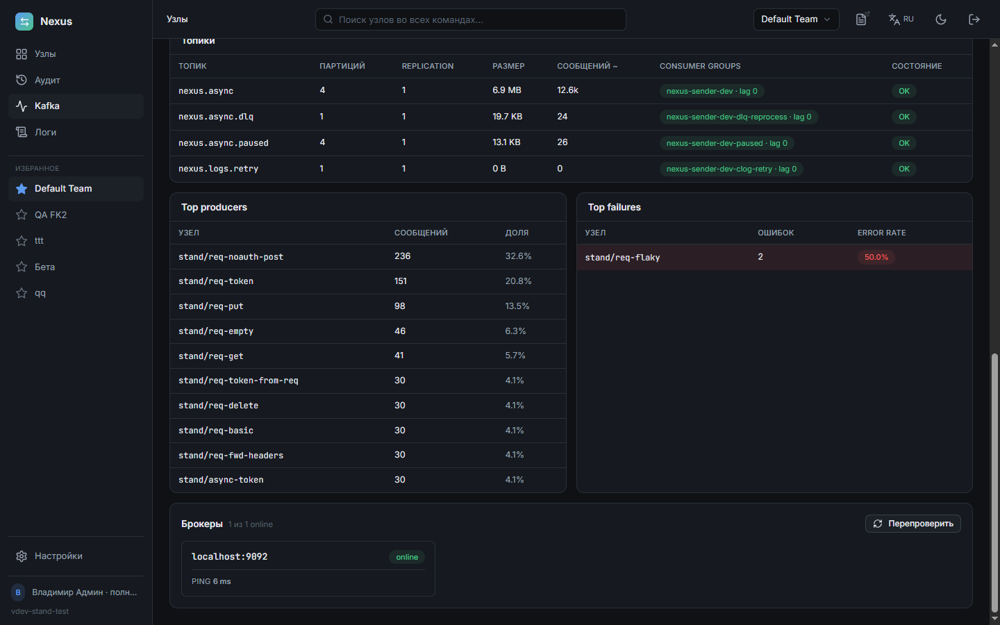
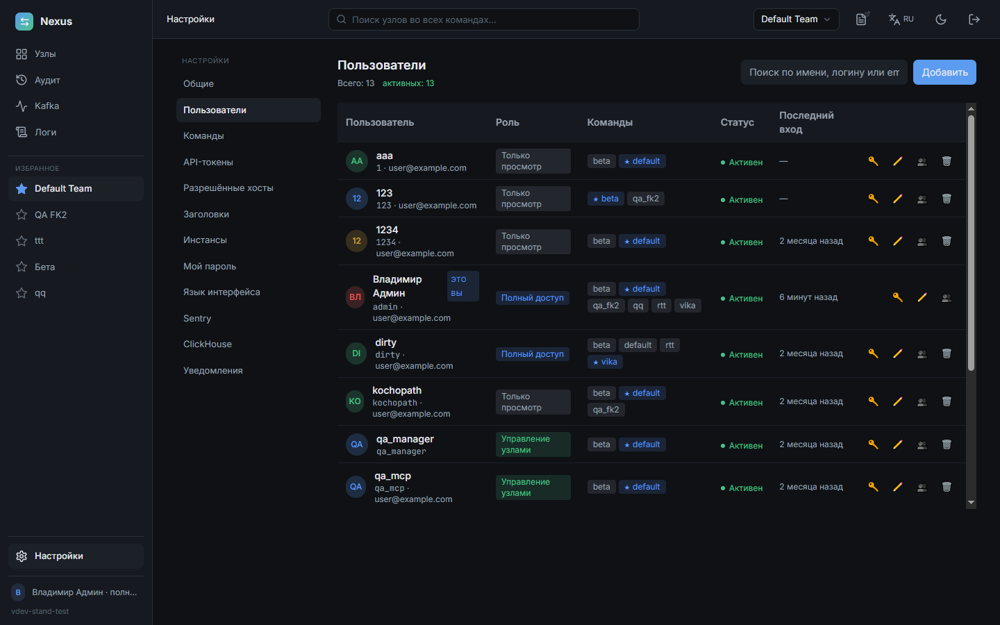
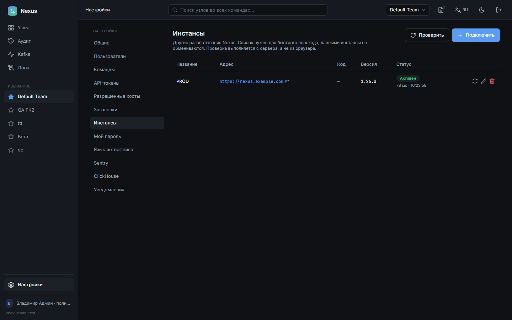
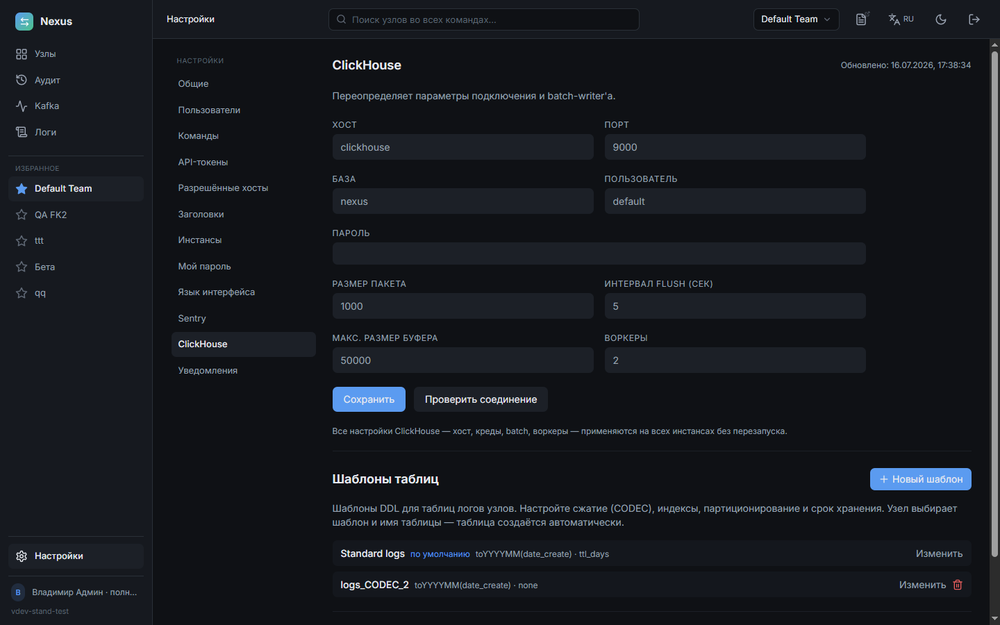
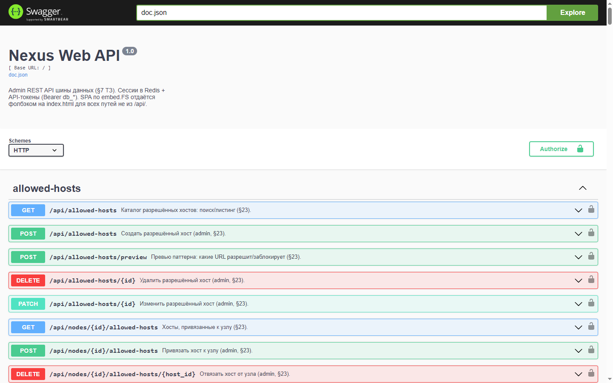

# Nexus — шина данных для HTTP-интеграций

[](go.mod)
[](web-ui/package.json)
[](migrations/)
[](specs/sections/05-storage.md)
[](specs/sections/05-storage.md)

**Nexus принимает входящие HTTP-запросы, по настроенному маршруту («узлу») отправляет их во внешнюю
систему — синхронно или через очередь — и сохраняет журнал каждого вызова.** Маршруты настраиваются
не в коде, а в веб-интерфейсе: адрес приёмника, HTTP-методы, авторизация на входе и на выходе,
таймауты, повторы, глубина логирования. Там же видно, что происходит: счётчики и графики по каждому
узлу, полный журнал запросов с телами, повтор упавшей доставки, состояние Kafka и логи самих
сервисов.

Типичные задачи, ради которых шину ставят между своими системами и чужими API:

- **Один вход вместо десятка интеграций.** Клиенту выдаётся адрес `…/api/v1/<команда>/<путь>`, а
  куда он ведёт на самом деле (и с какой авторизацией) — меняется в интерфейсе, без релиза клиента.
- **Приёмник тормозит или лежит.** Асинхронный узел отвечает клиенту сразу, кладёт запрос в Kafka и
  доставляет сам: с повторами, dead-letter, авто-репроцессором и защитой узла (circuit breaker).
- **«У вас не дошло» — надо доказать.** В журнале есть каждый вызов: время, метод, адрес, статус,
  длительность, тело запроса и ответа, IP и хост клиента; отсюда же — повтор (replay).
- **Несколько команд в одном контуре.** Узлы, логи и права разделены по командам, роли —
  admin / manager / viewer, каждое изменение попадает в аудит.


Полное ТЗ — [specs/nexus_spec.md](./specs/nexus_spec.md), по разделам —
[specs/sections/](./specs/sections/). Карта реализации (что готово, где лежит код, какие грабли) —
[specs/IMPLEMENTATION.md](./specs/IMPLEMENTATION.md).

---

## Как это работает

```text
                    ┌──────────────────────────────────────────────────┐
   клиент ─────────►│  Web :8000 — SPA + REST API + единый вход трафика │
                    └───────┬───────────────────────────────┬──────────┘
                            │ /api/v1/<команда>/<путь>       │ /api/*  (UI)
                            ▼                                ▼
                    ┌───────────────────┐            PostgreSQL — узлы, пользователи,
                    │ Receiver :8080    │              команды, аудит (креды — AES-256-GCM)
                    │ авторизация,      │            Redis — кеш узлов, сессии, статусы
                    │ резолв узла,      │
                    │ маскирование      │
                    └──┬─────────────┬──┘
              sync/gRPC│             │async → Kafka `nexus.async`
                       ▼             ▼
                    ┌───────────────────┐   HTTP    ┌──────────────────┐
                    │ Sender :9190      │──────────►│ внешняя система   │
                    │ retry, timeout,   │◄──────────│ (приёмник)        │
                    │ circuit breaker   │           └──────────────────┘
                    └─────────┬─────────┘
                              ▼
                    ClickHouse — журнал вызовов (тела, статусы, длительности)
```

Синхронный узел (`request`) ждёт ответ приёмника и возвращает его клиенту. Асинхронный
(`requestAsync`) отвечает сразу, а доставку берёт на себя Sender. Третий тип, `RabbitMQAsync`, ничего
не принимает по HTTP: он сам забирает сообщения из очереди RabbitMQ и доставляет их дальше.
Подробнее — [sections/02-architecture.md](./specs/sections/02-architecture.md).

---

## Возможности

### Маршрутизация

| Возможность | Что даёт | ТЗ |
| --- | --- | --- |
| Три типа узла: `request`, `requestAsync`, `RabbitMQAsync` | Синхронный проброс, доставка через Kafka, забор из очереди RabbitMQ | [§3](./specs/sections/03-receiver.md), [§27](./specs/sections/27-rabbitmq-async.md) |
| Короткий адрес `…/api/v1/<команда>/<путь>` | Клиенту не нужно знать, синхронный узел или нет; старые адреса продолжают работать | [§78](./specs/sections/78-node-url-and-log-counters.md) |
| Режим адреса: статичный `target_url` или адрес из запроса | Один узел на семейство приёмников | [§3](./specs/sections/03-receiver.md) |
| Проброс хвоста пути (path-passthrough) | `…/node/GetInfo` → `<target>/GetInfo` без отдельного узла на метод | [§39](./specs/sections/39-path-passthrough.md) |
| HTTP-методы входа/выхода, включая «Любой» | Приём любым методом, зеркалирование метода на выход | [§40](./specs/sections/40-any-http-method.md) |
| Проброс заголовков + справочник заголовков | Автодополнение имён, единый список на команду | [§24](./specs/sections/24-headers-catalog.md) |
| Шаблон ответа приёма (ack) для async | Клиенты с курсором получают эхо-подтверждение (`${ body.logs[*].logId \| max }`), а не общий `{"result":true}` | [§83](./specs/sections/83-async-ack-template.md) |
| Пауза и отключение узла | Остановить доставку, не удаляя маршрут; на паузе async копит, sync отвечает 202 | [§35](./specs/sections/35-queue-tab-rework.md) |
| Копирование и перенос узла между командами | Клон настроек (включая креды) с новым путём; перенос без потери общей таблицы логов | [§53](./specs/sections/53-copy-node.md), [§60](./specs/sections/60-node-move-shared-table.md) |
| Тестовый запрос (dry-run) | Проверка конфигурации до сохранения: mock-ответ или реальный вызов через Sender без следов в метриках | [§55](./specs/sections/55-dry-run-real-call.md) |

### Доставка и устойчивость

| Возможность | Что даёт | ТЗ |
| --- | --- | --- |
| Таймауты и повторы на узле | Свой предел длительности и число ретраев для каждого приёмника | [§3](./specs/sections/03-receiver.md) |
| Circuit breaker с ручным сбросом | Лежащий приёмник не держит воркеры; порог и cooldown настраиваются, состояние видно в UI, сброс — кнопкой | [§81](./specs/sections/81-breaker-manual-reset.md) |
| Dead-letter + авто-репроцессор | Недоставленное повторяется в фоне до TTL узла, а не теряется | [§36](./specs/sections/36-dlq-reprocessor.md) |
| Изоляция узлов в очереди | Медленный узел не блокирует остальных; видно, кто съедает ёмкость партиции | [§80](./specs/sections/80-async-throughput.md) |
| Защита от зацикливания | Служебный счётчик хопов `X-Nexus-Hops`, обрыв петли (508) и проверка self-reference при сохранении | [§32](./specs/sections/32-loop-protection.md) |
| Жёсткий лимит размера тела | Слишком большой запрос отклоняется явно (413/502), а не режется молча | [§43](./specs/sections/43-body-size-hard-limit.md) |
| Durable-retry журналов через Kafka | При недоступности ClickHouse батчи логов ждут в топике, а не в файлах на диске | [§38](./specs/sections/38-clog-retry-kafka.md) |

### Авторизация и безопасность

| Возможность | Что даёт | ТЗ |
| --- | --- | --- |
| Входящая авторизация: none / token / basic | Шина сама проверяет вызывающего | [§3](./specs/sections/03-receiver.md) |
| Исходящая авторизация: none / basic / token / токен из запроса | Свои креды приёмника или проброс клиентского токена | [§3](./specs/sections/03-receiver.md) |
| Универсальная динамическая авторизация | Источник (заголовок или query-параметр) и имя поля настраиваются, схема не удваивается | [§41](./specs/sections/41-universal-request-auth.md) |
| Шифрование кред AES-256-GCM | Пароли и токены узлов хранятся в PostgreSQL зашифрованными, в UI маскируются | [§5](./specs/sections/05-storage.md) |
| Каталог разрешённых хостов (SSRF) | Белый список exact/wildcard/regex с предпросмотром, привязка к узлам | [§23](./specs/sections/23-allowed-hosts-catalog.md) |
| Роли admin / manager / viewer | Матрица доступа, скрытие кред от viewer, self-service смена своего пароля | [§26](./specs/sections/26-roles-access-control.md) |
| API-токены и сессии | Доступ к REST API помимо браузерной сессии, настраиваемая длительность сессии | [§7](./specs/sections/07-web-ui.md), [§34](./specs/sections/34-ops-session-version-async-queue.md) |
| Аудит | Кто, когда и что поменял — с diff «было/стало» и экспортом в CSV | [§7](./specs/sections/07-web-ui.md) |

### Журнал вызовов

| Возможность | Что даёт | ТЗ |
| --- | --- | --- |
| Полный лог каждого вызова в ClickHouse | Время, метод, адрес, статус, длительность, размеры, тела запроса и ответа, IP | [§4.3](./specs/sections/04-sender.md) |
| Хост клиента (reverse-DNS) | Кто именно стучится, если IP ни о чём не говорит; фильтр по хосту | [§67](./specs/sections/67-client-host-rdns.md) |
| Поисковый мини-язык | `&` / `\|` / `-`, префиксы `url:`, `params:`, `req:`, `resp:`, режимы Aa / целое слово / regex | [§48](./specs/sections/48-log-search-extended.md) |
| Серверная фильтрация и keyset-пагинация | Фильтр применяется ко всей таблице, а не к загруженной странице; скролл не спотыкается на плотных секундах | [§72](./specs/sections/72-logs-server-side-filter.md) |
| Автоокно чтения и live-tail | Страница логов открывается за десятки миллисекунд на десятках миллионов записей; новые строки приходят сами | [§77](./specs/sections/77-logs-ux-and-scale.md) |
| Большие тела | Превью + догрузка срезами + скачивание файлом вместо зависшей вкладки | [§42](./specs/sections/42-log-body-streaming.md) |
| Replay | Повтор конкретного запроса или всех неудачных доставок за период — с защитой от дублей уже доставленного | [§79](./specs/sections/79-failed-unit-node-tab-metrics.md) |
| multipart/form-data | Вложения проходят насквозь, в журнал пишется сводка частей вместо содержимого файла | [§68](./specs/sections/68-multipart-form-data.md) |

### Метрики и мониторинг

| Возможность | Что даёт | ТЗ |
| --- | --- | --- |
| Рабочий стол команды | Входящие/исходящие/ошибки за период, карточки или таблица узлов, спарклайны с переходом в логи | [§44](./specs/sections/44-dashboard-counters.md), [§59](./specs/sections/59-nodes-ui-charts-config.md) |
| Метрики узла | Всего/доставлено/p95/p99, график запросов и латентности, круглый шаг, произвольный период, «пульс» узла | [§84](./specs/sections/84-node-observability.md) |
| Статус узла OK / Degraded / Down | Исход последнего вызова, переживающий рестарт (Redis), а не доля ошибок за период | [§46](./specs/sections/46-node-status-redis.md), [§52](./specs/sections/52-node-degraded-status.md) |
| Мониторинг Kafka | Здоровье кластера, throughput, lag, топики с размером (JMX), топ-узлы по нагрузке и по ошибкам | [§31](./specs/sections/31-kafka-monitoring.md), [§75](./specs/sections/75-topic-size-jmx.md) |
| Консоль логов сервисов | slog-вывод Receiver/Sender/Web в UI, смена уровня в runtime без рестарта, скачивание | [§51](./specs/sections/51-service-logging.md) |
| Prometheus + Telegram | `/metrics` у всех трёх сервисов, алерты операторам по расписанию | [§6](./specs/sections/06-metrics.md), [§20](./specs/sections/20-notifications.md) |
| Sentry | Ошибки и трейсы с вырезанными секретами и ограничением размера тел | [§14](./specs/sections/14-logging-sentry.md) |

### Хранилище логов

| Возможность | Что даёт | ТЗ |
| --- | --- | --- |
| Шаблоны таблиц ClickHouse | CODEC, индексы, партиционирование и TTL задаются один раз, таблица узла создаётся сама | [§19](./specs/sections/19-ch-templates.md) |
| Синхронизация схемы существующей таблицы | Предпросмотр ALTER'ов и явное применение вместо «настройка есть, а в таблице её нет» | [§56](./specs/sections/56-ch-schema-sync.md) |
| Внешняя (ручная) таблица | В таблицу пишет посторонний сервис, Nexus только читает; проверка пригодности схемы | [§64](./specs/sections/64-manual-external-table.md) |
| Атрибуция записей по узлу | Несколько узлов на одной таблице не видят чужие строки и не удаляют их | [§37](./specs/sections/37-node-id-in-logs.md), [§61](./specs/sections/61-log-attribution-and-move-preview.md) |
| Несколько инстансов Nexus на одном ClickHouse | Маркер владения защищает чужие таблицы от housekeeping и ALTER'ов | [§70](./specs/sections/70-multi-instance-clickhouse.md) |

### Команды и удобство

| Возможность | Что даёт | ТЗ |
| --- | --- | --- |
| Команды (multi-tenancy) | Узлы, логи, метрики и права разделены; своя БД ClickHouse на команду | [§18](./specs/sections/18-multi-tenancy.md) |
| Избранные команды и переключатель | Быстрый переход, порядок drag-and-drop | [§49](./specs/sections/49-favorite-teams.md) |
| Ссылки «Поделиться» на узел и на команду | Коллега открывает ту же страницу — команда переключается сама | [§58](./specs/sections/58-node-share.md), [§76](./specs/sections/76-team-share.md) |
| Глобальный поиск узлов | Поиск по всем командам пользователя + история последних запросов | [§62](./specs/sections/62-global-node-search.md) |
| Личные предпочтения | Период рабочего стола запоминается на пользователя и команду, а не на браузер | [§71](./specs/sections/71-user-preferences.md) |
| Реестр инстансов | Список соседних развёртываний с версией и статусом, переход в один клик | [§73](./specs/sections/73-instances-registry.md) |
| Русский и английский, тёмная и светлая тема | Переключается в шапке | [§7](./specs/sections/07-web-ui.md) |
| Swagger двух API прямо из шапки | Документация Receiver и Web раздаётся самим сервисом | [§25](./specs/sections/25-topbar-swagger.md) |
| Безопасный откат версии | Старый бинарь стартует на новой схеме, `--migrate-force`, строка «Откат» в каждом релизе | [§74](./specs/sections/74-safe-rollback.md) |

---

## Интерфейс

Скриншоты сняты на тестовом стенде (процедура — [docs/STAND_TESTING.md](./docs/STAND_TESTING.md)),
данные синтетические. Файлы лежат в [docs/img/](./docs/img/).

### Рабочий стол команды

Счётчики за выбранный период, список узлов с трафиком, ошибками, статусом и спарклайном. Два
представления — таблица и карточки; период, поиск, метод и статус сохраняются в адресе страницы.

| Таблица | Карточки |
| --- | --- |
| [](docs/img/overview.png) | [](docs/img/overview-cards.png) |

### Узел: обзор и настройка

Слева — страница узла: KPI, график трафика и последние запросы. Справа — форма маршрута с
предпросмотром: тип узла, путь, входящий метод, режим адреса, проброс хвоста пути.

| Обзор узла | Форма маршрута |
| --- | --- |
| [](docs/img/node-overview.png) | [](docs/img/node-form.png) |

Вкладка «Конфиг» показывает адрес узла в короткой и классической формах (с кнопками копирования),
команду-владельца, таймауты, таблицу логов и авторов создания/изменения. «Тестовый запрос» проверяет
конфигурацию по шагам — с mock-ответом или реальным вызовом приёмника.

| Конфигурация узла | Тестовый запрос (dry-run) |
| --- | --- |
| [](docs/img/node-config.png) | [](docs/img/node-dry-run.png) |

### Журнал запросов

Каждый вызов с телами запроса и ответа, расширенные фильтры (поиск с префиксами и regex, метод,
даты, хост клиента), live-режим и повтор запроса.

[](docs/img/node-logs.png)

### Метрики узла

Всего/доставлено/p95/p99, график запросов и латентности p50/p95, выбор периода и шага, «последняя
активность» — когда узел вообще подавал признаки жизни.

[](docs/img/node-metrics.png)

### Очередь и защита узла

Ожидающие отправки и неудачные доставки за период, повтор и очистка, пауза/отключение узла. Здесь же
видно сработавшую защиту (circuit breaker) с обратным отсчётом до пробы и кнопкой ручного сброса.

[](docs/img/node-queue.png)

### Мониторинг Kafka

Здоровье кластера, сообщения и lag за период, throughput, топики с размером на дисках, топ-узлы по
объёму и по ошибкам, состояние брокеров.

| Обзор кластера | Топики и узлы-лидеры |
| --- | --- |
| [](docs/img/kafka.png) | [](docs/img/kafka-topics.png) |

### Эксплуатация

Журнал аудита с diff'ами изменений и консоль служебных логов трёх сервисов с фильтрами по сервису и
уровню, живым режимом и скачиванием.

| Аудит | Логи сервисов |
| --- | --- |
| [](docs/img/audit.png) | [](docs/img/service-logs.png) |

### Настройки

Пользователи с ролями и командами, реестр соседних инстансов, параметры ClickHouse и шаблоны таблиц
логов.

| Пользователи и роли | Инстансы | ClickHouse и шаблоны |
| --- | --- | --- |
| [](docs/img/settings-users.png) | [](docs/img/settings-instances.png) | [](docs/img/settings-clickhouse.png) |

### Swagger

REST API Web и Receiver раздаются самим приложением — `/swagger/index.html`, ссылка есть в шапке.

[](docs/img/swagger.png)

---

## Зависимости

| Компонент    | Версия |
|--------------|--------|
| Go           | 1.26   |
| PostgreSQL   | 16     |
| Redis        | 7      |
| ClickHouse   | 24     |
| Kafka        | 3.9 (KRaft) |
| Prometheus   | 2.55   |

## Минимальные ресурсы

Для низкой нагрузки (единицы запросов в секунду) с **внешним ClickHouse** — основной прод-путь,
корневой [docker-compose.yml](./docker-compose.yml):

| Ресурс | Минимум | Рекомендуется |
|--------|---------|---------------|
| vCPU   | 2       | 2–4           |
| RAM    | 2 ГБ    | 4 ГБ          |
| Диск   | 10 ГБ   | 20 ГБ         |

В простое весь стек занимает меньше 0.1 ядра, а память распределяется так (замеры
Linux-контейнеров): `receiver` 8 МиБ, `sender` 13 МиБ, `web` 19 МиБ, PostgreSQL ~145 МиБ,
Redis ~20 МиБ, Prometheus ~76 МиБ — и Kafka, самый прожорливый компонент. С урезанным heap
она занимает ~515 МиБ (замер), с дефолтным `-Xmx1G -Xms1G` дорастает примерно до 1.2 ГБ.
Поэтому **2 ГБ достижимы только с `KAFKA_HEAP_OPTS=-Xmx512m -Xms256m`**: переменная объявлена
в compose-файлах со значением по умолчанию `-Xmx1G -Xms1G` и переопределяется через `.env` или
compose-override. Готовый профиль под 2 ГБ / 2 ядра (heap Kafka, лимиты памяти контейнеров,
retention Prometheus) — [deploy/docker-compose.override.yml](./deploy/docker-compose.override.yml):
скопируйте его в корень, и Compose подхватит профиль автоматически.

Kafka обязательна даже при чисто синхронном трафике: `receiver` и `sender` создают топики на
старте и без брокера завершаются с кодом 1. Prometheus, наоборот, можно не поднимать — платой
будут нулевые KPI/графики в панели и неработающие Telegram-алерты. Сам внешний ClickHouse в этот
бюджет не входит: ему нужно 2 vCPU / 2–4 ГБ плюс место под логи.

Полный разбор — замеры по компонентам, минимальный профиль конфигурации (пулы, воркеры,
retention) и требования к серверу под сборку образов — в
[DEPLOYMENT.md §5.4](./DEPLOYMENT.md).

## Установка, запуск и отладка

- **Развёртывание в продакшене** — [DEPLOYMENT.md](./DEPLOYMENT.md): установка на чистом
  Linux-сервере, запуск полностью в Docker и с внешними сервисами
  (PostgreSQL/ClickHouse/Kafka/Redis), где задавать адреса/логины/пароли, обновление,
  смена версии и откат, запуск под Docker на Windows.
- **Локальная разработка и отладка в VS Code (Windows)** — [DEVELOPMENT.md](./DEVELOPMENT.md):
  порядок первого запуска, миграции, варианты запуска под отладчиком, запуск всех трёх
  сервисов одной кнопкой.
- **Ручной сквозной прогон на стенде** — [docs/STAND_TESTING.md](./docs/STAND_TESTING.md):
  сценарий с узлами всех типов, генератором нагрузки и чек-листом проверки в UI.

Самый короткий путь (полностью в Docker):

```bash
cp .env.example .env       # отредактируйте пароли + ENCRYPTION_KEY (см. DEPLOYMENT.md §2)
docker compose -f deploy/docker-compose.yml up -d --build
docker compose -f deploy/docker-compose.yml run --rm web --set-admin-password 'mySecretPass'
curl http://localhost:8000/health
```

UI на `http://localhost:8000/`. Swagger UI — `http://localhost:8000/swagger/index.html`.

## Создание первого узла и тестовый запрос

Проще всего создать узел в интерфейсе («Новый узел» на рабочем столе) — форма показывает
предпросмотр маршрута и полный адрес, а таблица логов создаётся автоматически по выбранному
шаблону ClickHouse. То же самое через API:

```bash
# из-под admin-сессии (cookie nexus_session):
curl -X POST http://localhost:8000/api/nodes -b cookies.txt \
  -H "Content-Type: application/json" \
  -d '{
    "path": "test/echo",
    "root_method": "request",
    "incoming_method": "POST",
    "outgoing_method": "POST",
    "url_mode": "static",
    "target_url": "https://httpbin.org/anything",
    "auth_type": "none",
    "incoming_auth_type": "none",
    "logging_enabled": true,
    "clickhouse_table": "nexus_default.test_echo"
  }'

# отправить запрос через шину (единый вход Web :8000; напрямую в Receiver :8080 тоже работает):
curl -X POST http://localhost:8000/api/v1/default/test/echo \
  -H "Content-Type: application/json" \
  -d '{"hello":"world"}'
```

Короткая форма адреса `/api/v1/<команда>/<путь>` ([§78](./specs/sections/78-node-url-and-log-counters.md))
и классическая `/api/v1/request/<путь>` работают обе.

## Запуск для разработки

- Локальный запуск под отладчиком VS Code (Windows) с зависимостями в Docker Desktop —
  [DEVELOPMENT.md](./DEVELOPMENT.md).
- Запуск без VS Code: `make docker-up-dev` (поднять зависимости) → `make migrate-up` →
  `make set-admin-password PASSWORD=...` → `make run-receiver` / `run-sender` / `run-web`
  (каждый в своём терминале). Полный список целей — `make help`.

## Конфигурация

- `config/config.yml` — production, в git не коммитится. Шаблон — `config/config.example.yml`.
- `config/config_debug.yml` — localhost-адреса для `make run-*`.
- `.env` — секреты, в git не коммитится.

Выбор конфига по приоритету: `--config` → `$NEXUS_CONFIG` → `--debug` → `config/config.yml`.
Полная карта переменных `.env` (адреса/логины/пароли хранилищ, `ENCRYPTION_KEY`) — в
[DEPLOYMENT.md](./DEPLOYMENT.md) §2.

## API

- Receiver `:8080` — `/api/v1/*` (боевой трафик: короткая форма и `request`/`requestAsync`/`callback`),
  `/health`, `/ready`, `/metrics`. Штатно трафик идёт через единый вход Web (`:8000`, те же
  `/api/v1/*` проксируются в Receiver).
- Sender `:9190` (gRPC SenderService) + admin `:9091` (`/health`, `/ready`, `/metrics`).
- Web `:8000` — `/api/*`, SPA (React, отдаётся из `embed.FS`), `/health`, `/ready`, `/metrics`.

OpenAPI / Swagger: `make swagger` генерирует [docs/web/](./docs/web/) и [docs/receiver/](./docs/receiver/)
из аннотаций в Go-handlers; `make swagger-drift-check` для CI. Интерактивный UI —
`http://localhost:8000/swagger/index.html` (переключатель между двумя документами — в шапке SPA).

## Сборка образов и деплой

Образы в CI **не** собираются и в registry **не** публикуются. Деплой — сборкой из
исходников на сервере: `docker compose up -d --build` (версия вшивается из git-тега —
нужен checkout с `.git`, см. [DEPLOYMENT.md §9](./DEPLOYMENT.md)). Перед обновлением текущие
образы версионируются (`scripts/deploy/images.sh tag`), иначе откат превращается в пересборку —
см. [§74](./specs/sections/74-safe-rollback.md).

## CI/CD

Pipeline живёт в [.gitlab-ci.yml](./.gitlab-ci.yml), запускается на self-hosted
runner с тегом `srv-d-android-l-docker` (docker-executor). Stages:

| Stage         | Что делает                                                                  |
|---------------|-----------------------------------------------------------------------------|
| `test`        | `go vet ./...`, `go test -race -short ./...`                                |
| `lint`        | `golangci-lint run`, `swagger-drift` (проверка `docs/` против аннотаций)    |
| `build`       | `go build ./...`, `ui-build` (Vite + lint + build для `web-ui/`)            |
| `integration` | testcontainers PG/Redis/Kafka/CH; `loadtest` (auto на master/теге `v*`, manual на dev) |
| `security`    | `govulncheck`, `gosec`, `trivy-fs`, `renovate` (weekly schedule)            |

Селективный ручной запуск через **«Run pipeline»** в UI с переменной
`RUN_PROFILE = integration-only | loadtest-only` (см. шапку [.gitlab-ci.yml](./.gitlab-ci.yml)
для required CI/CD Variables). Авто-апдейты зависимостей — [renovate.json](./renovate.json)
по weekly schedule.

## Вклад в проект

См. [CONTRIBUTING.md](./CONTRIBUTING.md) — конвенции, процесс работы, CI/release pipeline.

## Changelog

История изменений по версиям — в [CHANGELOG.md](./CHANGELOG.md) (формат Keep a Changelog).
Каждая версия содержит строку «Откат»: сколько миграций откатывать при возврате на предыдущую
версию и что при этом теряется.

## Тестирование

См. [TESTING.md](./TESTING.md) (unit / integration / loadtest) и
[docs/STAND_TESTING.md](./docs/STAND_TESTING.md) (ручной прогон на живом стенде).

## Где смотреть, что реализовано

Подробная карта реализации с привязкой к разделам ТЗ, ссылками на ключевые файлы,
архитектурными решениями и неочевидностями — в [specs/IMPLEMENTATION.md](./specs/IMPLEMENTATION.md).
Этот документ создан специально для быстрого onboarding'а новых разработчиков
и агентов (включая Claude Code в будущих сессиях).

## Структура проекта

```text
/cmd
  /receiver, /sender, /web, /loadtest, /echosrv
/internal
  /platform        # общая инфраструктура (config, logging, sentry, runner,
                   #   healthcheck, pg, redis, clickhouse, kafka, crypto,
                   #   ratelimit, circuitbreaker, safego, nodeevents, rdns)
  /domain          # shared kernel (Node, User, Session, LogRecord, AuditEntry, APIToken,
                   #   logsearch, ackspec)
  /receiver        # Receiver: handlers, usecase, gRPC client, NodeReader
  /sender          # Sender: gRPC server, Kafka consumer, HTTP-клиент, ClickHouse writer
  /web             # Web: handlers, usecase, repo, собранный SPA в static (embed.FS)
/proto/sender/v1   # .proto + сгенерированные pb.go / pb_grpc.go
/migrations        # SQL-миграции (golang-migrate)
/config            # YAML
/deploy            # docker-compose, Dockerfile, prometheus.yml
/docs              # Swagger-документы, STAND_TESTING.md, img/ — скриншоты интерфейса
/scripts           # стенд, релизы, деплой
/specs             # ТЗ по разделам + карта реализации
/web-ui            # исходники SPA (React 18 + Vite + Tailwind), см. README в каталоге
```

## Лицензия

ООО "АПЕКС ТЕХНОЛОДЖИС"
